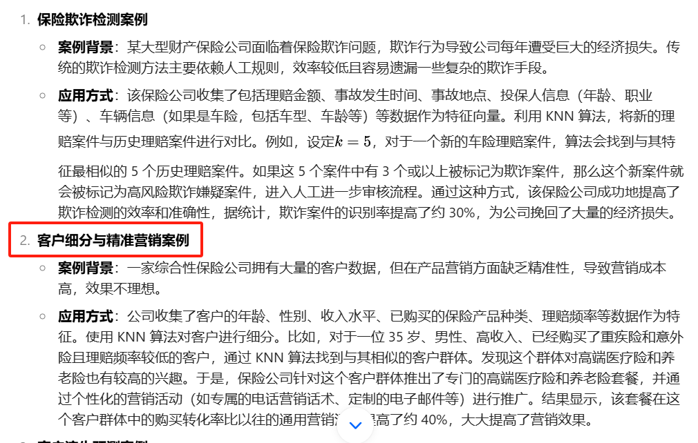

# https://www.cjavapy.com/article/3245/

K-近邻算法（K-Nearest Neighbors, KNN）是一种基本且广泛应用的机器学习算法。
它属于监督学习，通常用于分类任务，但也可以用于回归。
它基于这样一个假设：与某个数据点距离最近的 K 个数据点很可能与该数据点属于同一类别。
KNN 算法是一种简单有效的机器学习算法，适用于各种类型的机器学习任务。
KNN算法对于数据规模大的情况计算成本较高，因为它需要为每个测试样本计算距离。
KNN对于数据缩放敏感，通常需要先进行特征缩放（如标准化或归一化）。
选择合适的K值非常关键，通常需要通过交叉验证来选定最佳K值。

1、理解KNN算法
K-最近邻（K-Nearest Neighbors，KNN）算法是一种基本且易于实现的机器学习算法，广泛应用于分类和回归问题。
它是一种基于实例的学习（Instance-based learning），或者称为懒惰学习（Lazy learning），
因为它不会从训练数据中学习一个固定的模型，而是使用整个数据集进行预测。
其工作原理包括：首先计算测试数据点与每个训练数据点之间的距离，接着选取距离最近的K个邻居。
在分类问题中，测试点的类别由这些邻居中最常见的类别决定；在回归问题中，则通常是这些邻居值的平均值。

KNN的效能在很大程度上取决于K值的选择和距离度量的方式。
选取合适的K值是至关重要的，太小的K值会使模型对噪声敏感，而太大的K值可能使模型无法捕捉到数据的特性。
此外，由于KNN对特征的尺度敏感，特征缩放（如标准化或归一化）通常是预处理步骤的一部分。
虽然KNN易于实现且通常不需要太多调优，但它在处理大数据集或维度很高的数据集时效率不高，
且对噪声和异常值比较敏感。适用于多分类问题。

2、scikit-learn
scikit-learn 是 Python 中一个强大的机器学习库，它提供了各种常用机器学习算法的简单易用的实现。
使用 scikit-learn，可以快速进行数据预处理、模型训练、评估和预测，从而进行有效的机器学习分析。

1）安装命令

pip install scikit-learn

2）导入所需模块

from sklearn.model_selection import train_test_split
from sklearn.neighbors import KNeighborsClassifier
from sklearn.metrics import classification_report, confusion_matrix
from sklearn.datasets import load_iris
3、数据集
使用scikit-learn自带的鸢尾花（Iris）数据集，鸢尾花数据集是机器学习领域经典的入门数据集，
由英国统计学家 R. A. Fisher 于 1936 年首次提出。该数据集包含 150 个样本，每个样本代表一朵鸢尾花，
并包含 4 个特征：花萼长度 (Sepal_Length)、花萼宽度 (Sepal_Width)、花瓣长度 (Petal_Length)、花瓣宽度 (Petal_Width)。
通过 4 个特征可以用来描述鸢尾花的形状和大小。数据集还包含每个样本的类别标签，鸢尾花有 3 个品种：山鸢尾 (Iris-setosa)、变色鸢尾 (Iris-versicolor)、
维吉尼亚鸢尾 (Iris-virginica)。

使用 scikit-learn 加载鸢尾花数据集代码如下，
from sklearn.datasets import load_iris
iris = load_iris()
# 查看数据信息
print(iris.DESCR)
# 查看数据
print(iris.data)
# 查看目标
print(iris.target)

4、划分数据集
使用train_test_split函数将数据集划分为训练集和测试集，train_test_split函数是Scikit-Learn库中一个非常重要的工具。常用参数如下，


```python
from sklearn.model_selection import train_test_split
from sklearn.neighbors import KNeighborsClassifier
from sklearn.metrics import classification_report, confusion_matrix
from sklearn.datasets import load_iris
from sklearn.metrics import accuracy_score

# 加载示例数据集，如鸢尾花数据集
iris = datasets.load_iris()
X = iris.data
y = iris.target

# 使用train_test_split函数划分数据集
# 测试集占比30%，保持类别比例，设置随机种子为42以确保结果一致性
X_train, X_test, y_train, y_test = train_test_split(X, y, test_size=0.3, random_state=42, stratify=y)

# 创建KNN分类器实例
knn = KNeighborsClassifier(
    n_neighbors=3,  # 设置邻居的数量为3
    weights='distance',  # 设置权重为距离的倒数
    algorithm='kd_tree',  # 使用KD树算法
    leaf_size=40,  # 设置KD树/球树的叶子大小
    p=1,  # 设置Minkowski距离的幂参数为1（曼哈顿距离）
    metric='euclidean'  # 使用欧氏距离作为距离度量
)

knn.fit(X_train, y_train)
# 预测和评估
y_pred = knn.predict(X_test)
print("Accuracy:", accuracy_score(y_test, y_pred))
```

6、调整参数
实践中可能需要调整KNN模型的参数（如K的值）来获得更好的性能。可以通过交叉验证等方法来找到最佳的参数。
n_neighbors 参数选择最近邻的数量。增加n_neighbors会使模型更稳定，但可能导致欠拟合；
减少n_neighbors可能导致过拟合。weights 参数确定邻居的权重。可以选择 'uniform' 使所有邻居具有均等权重，
或者选择 'distance' 赋予距离较近的邻居更大的权重。algorithm参数指定了计算最近邻的方法，
可选项包括 'auto', 'ball_tree', 'kd_tree', 'brute'，其中'auto'会自动选择最适合数据的算法。
最后，metric参数用于定义距离度量，常用的有欧几里得距离（'euclidean'）和曼哈顿距离（'manhattan'）。
通过适当调整这些参数，可以大幅提升KNN模型在特定数据集上的表现。

7、欧几里得距离（Euclidean Distance）和 曼哈顿距离（Manhattan Distance）
K-近邻（K-Nearest Neighbors，KNN）算法是一种常用的分类和回归方法。KNN算法的核心思想是找出测试数据在特征空间中的K个最近邻居，
并根据这些邻居的信息来预测测试数据的标签或值。KNN算法中一个重要的概念是距离度量，
它用于计算特征空间中点之间的距离。Scikit-learn的KNN实现支持多种距离度量，其中最常用的是“欧几里得距离”（Euclidean distance）
和“曼哈顿距离”（Manhattan distance）。

1）欧几里得距离（Euclidean Distance）
欧几里得距离是最常见的距离度量方法，定义为两点间的直线距离。在二维空间中，它就是两点间的直线距离。
```python
def euclidean_distance(point1, point2):
    """计算欧几里得距离"""
    return sum((p1 - p2) ** 2 for p1, p2 in zip(point1, point2)) ** 0.5

# 示例点
point1 = (1, 2)
point2 = (4, 6)

# 计算两点之间的欧几里得距离
eu_dist = euclidean_distance(point1, point2)


print(eu_dist)
```

2）曼哈顿距离，也称为城市街区距离，是另一种常用的距离度量方法。它是两点在标准坐标系上的绝对轴距总和。
```python
def manhattan_distance(point1, point2):
    """计算曼哈顿距离"""
    return sum(abs(p1 - p2) for p1, p2 in zip(point1, point2))

# 示例点
point1 = (1, 2)
point2 = (4, 6)

# 计算两点之间的曼哈顿距离
man_dist = manhattan_distance(point1, point2)

print(man_dist)
```


欧几里得距离_曼哈顿距离_切比雪夫距离
　　欧几里得距离，欧氏距离，也就是我们熟知的距离，可扩展至m维
　　2维：d=sqrt((x1-x2)2+(y1-y2)2)
　　3维：d=sqrt((x1-x2)2+(y1-y2)2+(z1-z2)2)
　　m维：d=sqrt(∑(xi,1-xi,2)2)


　　曼哈顿距离，出租车距离，在一个横竖分布的网格上，两点之间的距离即为曼哈顿距离
　　也就是说只能横着走或者竖着走
　　d=|x1-x2|+|y1-y2|


　　切比雪夫距离，棋盘距离，在一个国际棋盘上，王从一点到另一点的距离
　　王可以向周围八个方向走，显然最优决策是先不断斜着靠近，再横着或者竖着达到目标点
　　d=max(|x1-x2|,|y1-y2|)



 